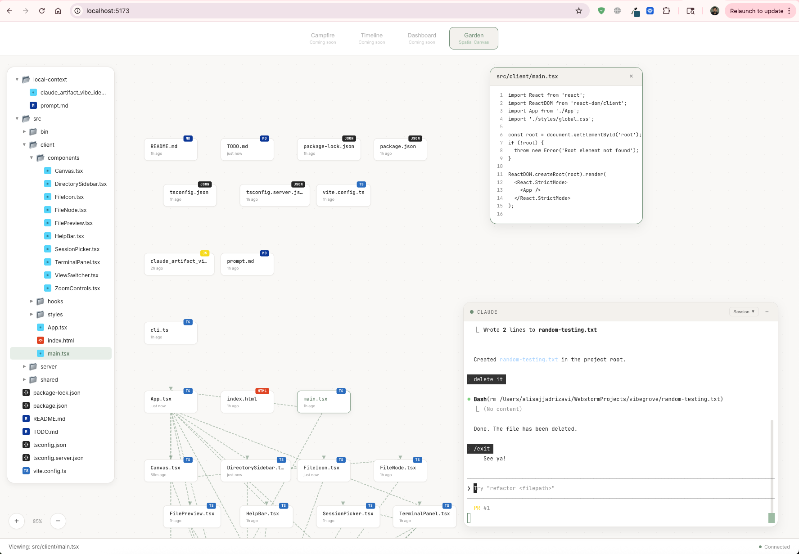

# VibeGrove

A calm, spatial IDE for vibe coding. Watch your files as nodes on a canvas, see connections between them, and interact with Claude Code in a floating terminal.



## Features

- **Spatial Canvas** - Files displayed as draggable nodes with import connections
- **Real-time Updates** - Files pulse when modified, new files animate in
- **Floating Terminal** - Draggable, resizable terminal panel for Claude Code
- **File Preview** - Click any file to see its contents
- **Calm Theme** - Soft, easy-on-the-eyes color palette

## Quick Start

```bash
# Install dependencies
npm install

# Build the project
npm run build

# Link globally (one-time setup)
npm link
```

Then run in any project:

```bash
cd /path/to/your/project
vibegrove
```

This opens VibeGrove at http://localhost:3000 showing your project's files.

## Development

```bash
# Start dev server with hot reload
npm run dev
```

- Vite dev server: http://localhost:5173 (use this for development)
- Backend server: http://localhost:3000

### Testing Features

1. **Pan** - Drag the canvas background
2. **Zoom** - Scroll or use +/- buttons (bottom-left)
3. **Select file** - Click a node to open preview panel
4. **Move panels** - Drag terminal or preview by their headers
5. **Resize terminal** - Drag the edges/corners

## Running on Other Projects

### Option 1: Direct run

```bash
cd /path/to/your/project
node /path/to/vibegrove/dist/server/index.js
```

### Option 2: Global command (recommended)

```bash
# In vibegrove directory (one-time setup):
npm run build
npm link

# Then from any project:
cd /path/to/your/project
vibegrove
```

### Option 3: npx (after publishing)

```bash
cd /path/to/your/project
npx vibegrove
```

## Scripts

| Command | Description |
|---------|-------------|
| `npm run dev` | Start dev server with hot reload |
| `npm run build` | Build for production |
| `npm start` | Run production server |
| `npm run typecheck` | Run TypeScript type checking |

## Known Issues

### node-pty on macOS

If you see `posix_spawnp failed`, the terminal will fall back to a mock mode. File visualization still works. To fix:

```bash
npm rebuild node-pty --build-from-source
```

Or with Python specified:

```bash
npm rebuild node-pty --python=/usr/bin/python3
```

## Tech Stack

- **Frontend**: React 18, xterm.js, Vite
- **Backend**: Node.js, Express, WebSocket, chokidar
- **Language**: TypeScript (strict mode)

## Project Structure

```
vibegrove/
├── src/
│   ├── client/          # React frontend
│   │   ├── components/  # UI components
│   │   ├── hooks/       # React hooks
│   │   └── styles/      # Theme and CSS
│   ├── server/          # Node.js backend
│   │   ├── index.ts     # Express + WebSocket server
│   │   ├── terminal.ts  # PTY management
│   │   ├── watcher.ts   # File watching
│   │   └── imports.ts   # Import graph parsing
│   ├── shared/          # Shared types
│   └── bin/             # CLI entry point
├── dist/                # Build output
└── package.json
```

## License

MIT
